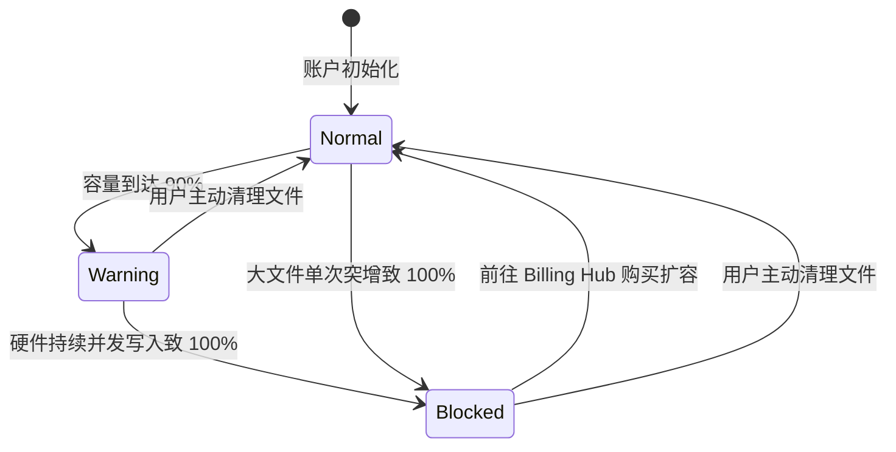
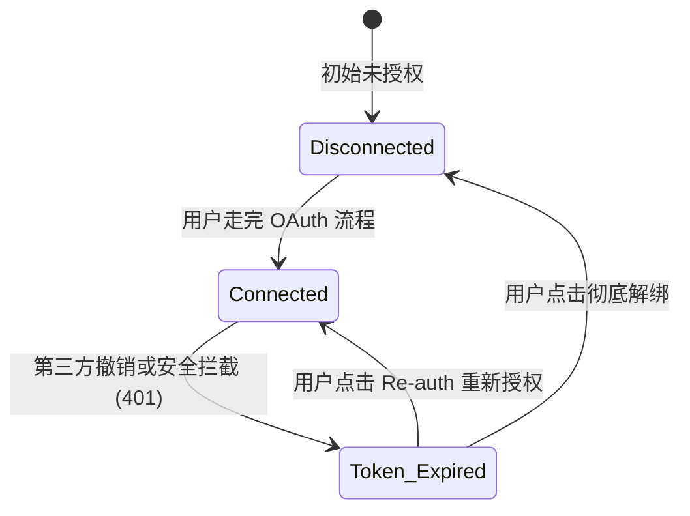

# 网页端中转站设置分析与架构概述 (Overview)

基于硬件端 PRD 的分析，本模块定义了 Web 端中转站独有的设置边界与架构。我们的核心设计哲学是：**防范 Edge Cases 的本质，就是建立完整且闭环的状态机**。所有看似极端的异常流，都必须收敛至明确的状态流转中。

## 1. 用户任务与 MVP 范围 (User Tasks & MVP Scope)

### 用户任务
用户来到 Transfer Settings，主要为了完成什么？

| 用户任务 | 对应模块 |
| --- | --- |
| 查看账户和存储状态 | Account |
| 设置录音/文件同步保留策略 | Sync |
| 连接 Notion / Google Drive 等导出目的地 | Export |
| 设置 AI 自动处理偏好 | AI Boost (CLI 扩展) |
| 处理异常：空间满、授权失效、隐私设置确认 | Account / Export |

### MVP 范围 / 非范围
**MVP In Scope：**
- 四个 Tab 的基础信息架构
- 存储容量展示与 90% / 100% 状态
- Retention 设置
- Notion 授权状态展示与重授权
- data training opt-in 默认关闭

**Out of Scope for v1：**
- Billing Hub 完整购买流程
- 多个第三方集成的完整管理
- 团队/企业权限管理
- 复杂 AI workflow builder
- 历史导出日志与失败重试队列可视化

---

## 2. 软硬件隔离原则 (Boundary Definitons)

### 🛑 硬件端独占 (Device Only)
- WLAN / 前光 / 锁屏密码 / 手势操作。网页端**绝对不越权**处理这些环境与传感器配置。

### 🌐 网页端控制权 (Web Transit Station)
提供对多端通用的云资源、第三方集成与 AI 工作流的治理。呈现为四大平滑切换的 Tab：`Account`、`Sync`、`Export`、`AI Boost`。

---

## 3. 核心状态机与闭环设计 (State Machines & Closed-loop Flows)

以下链路详述了从稳态到极端边界态，再从边界自愈回稳态的系统设计。

### A. 存储空间熔断与恢复闭环 (Storage Quota Flow)
负责管理 `Account & Profile` 面板中的容量。



**业务规则闭环：**
1. **Warning 触发**：当达到 90% 时，网页端前端获取到信号，UI 静默渲染红色警示进度条。此时硬件上传**不断联**。
2. **Blocked 阻断**：突破 100% 阈值的瞬间，Transit Station API 网关强制拒绝一切硬件的 `POST /files` 请求，统一返回 HTTP 403，Body 必须包含以下结构以便前端准确判断异常类型：
```json
{
  "error_code": "storage_quota_exceeded",
  "message": "Storage quota exceeded",
  "current_usage_bytes": 1000000000,
  "quota_bytes": 1000000000
}
```
网页端前端将同步状态标记为红色的 `Sync Blocked`。
3. **自愈恢复**：用户只有两条路——购买升级，或删除旧文件。操作生效后，后端触发 webhook 解除网关锁定，系统重归 Normal。

### B. 第三方授权自愈闭环 (Integration Token Flow)
管理如 Notion 等数据导出的生命周期。



**业务规则闭环：**
1. **隐式降级**：后端在执行例行导出时，若被 Notion 接口阻断，抛出 401，后端不得默默丢弃，必须立刻将该用户设置表的 `connections.notion.status` 强置为 `token_expired`。
2. **前端捕获**：用户打开网页端设置时，接口返回 `token_expired`，前端屏蔽正常的管理界面，高亮显示橙色的“Re-authenticate”按钮。
3. **再次握手**：用户按指示重新过一遍 OAuth，后端刷新 Token，状态机回归闭环内的 `Connected` 态。

---

## 4. 数据同步与保存机制 (Sync & Save Mechanism)

由于设置项贯穿整个 Web 端且影响全局工作流，需要建立清晰的前后端交互机制：

### A. 自动保存与防抖 (Auto-save & Debounce)
- **保存机制**：所有设置项（包括 Toggle 开关和下拉选择框）均采用**自动保存**机制，无需额外的 "Save" 或 "Apply" 按钮。
- **防抖策略 (Debounce)**：对于连续快速的操作（例如连续切换开关），前端必须引入至少 500ms 的防抖机制，合并网络请求以防止竞态条件和后端瞬时压力过大。
- **状态反馈**：在自动保存请求发出且未返回确认响应时，该设置项旁必须渲染“正在保存”的 Loading 状态。若保存失败，前端必须强制将 UI 状态**回弹**至修改前，并触发全局 Toast 报错。

### B. 状态轮询与实时性 (Polling Strategy)
- **常规设置项**：采用**按需加载**。仅在用户打开（或刷新）Settings 页面时请求一次 `GET /user/settings`，随后靠用户的操作自动保存。
- **强相关状态 (Storage Quota)**：由于 Account 面板中的云空间状态 (Storage Quota) 可能被外部硬件高频改变：
  - 如果用户停留在 Account 页面，前端应开启长轮询 (Long-polling) 或短轮询 (每 30 秒一次) 来刷新空间占用率。
  - 一旦收到 `quota_exceeded` 的响应，必须立即渲染红色阻断提示。

---

## 5. AI Boost 预留声明 (AI Boost MCP / CLI)
关于 `AI Boost` 的具体配置项目前由极客命令行 `$ npx @cuneflow/ai-boost init` (基于 MCP 协议) 占位，其数据契约与产品逻辑将由独立的专项需求铺开。
> **注：** 当 AI Boost (MCP CLI) 专项 PRD 编写完成后，请在此处补充指向该 PRD 的永久链接，以完善闭环。
